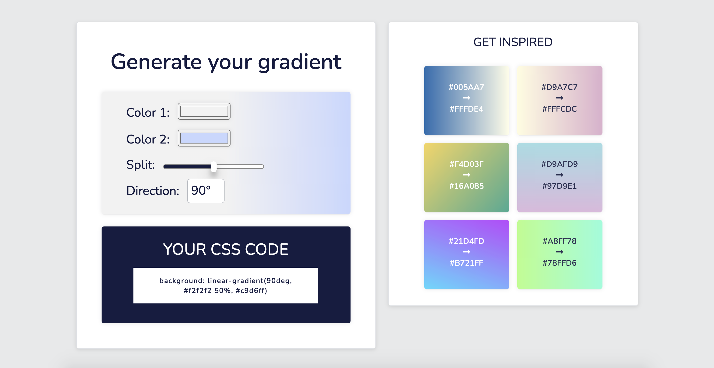

# Gradient Generator

This is a solution to the [Weekly Web Dev Challenge on Scrimba](https://scrimba.com/learn/weeklychallenge/the-weekly-web-dev-challenge-gradient-generator--co54c4b29830fcb5dfe04c953).

## Table of contents

- [Overview](#overview)
  - [The challenge](#the-challenge)
  - [Screenshot](#screenshot)
  - [Links](#links)
- [My process](#my-process)
  - [Built with](#built-with)
  - [Continued development](#continued-development)
  - [Useful resources](#useful-resources)
- [Author](#author)

## Overview

### The challenge

Scrimba Task: Write a function to:

- Generate a gradient using the colors from the pickers and split percentage from the slider.
- Use the gradient as the form background.

Scrimba stretch goal:

- Check for contrast between the gradient and the text.

Own stretch goal:

- Add a few inspirations. When a specific inspiration is selected, use it to style the form.

### Screenshot

### Links

- [Solution URL](https://scrimba.com/scrim/coae346fbbc5accb41d7872e0)
- [Live site URL](https://miri52.github.io/gradient-generator/)

## My process

### Built with

- Mobile-first workflow
- Flexbox
- Media queries
- JSON data
- async/await

### Continued development

- improve CSS: CSS Variables / Sass / Less
- more features: add more colors / add a 'surprise me' button

### Useful resources

- [Calculating Color Contrast](https://24ways.org/2010/calculating-color-contrast/)
- [Dynamically Changing Text Color](https://gomakethings.com/dynamically-changing-the-text-color-based-on-background-color-contrast-with-vanilla-js/)

## Author

- LinkedIn - [Miriama Svítková](https://www.linkedin.com/in/miriama-svitkova)
- Frontend Mentor - [miri52](https://www.frontendmentor.io/profile/miri52)
